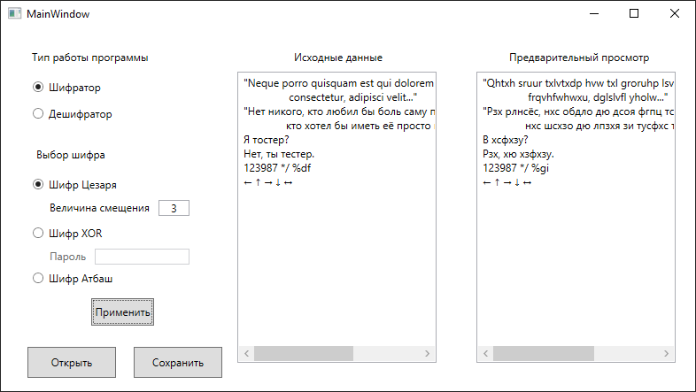

# Encryptor
Программа позволяет шифровать / дешифровать файл с использованием шифра Атбаша, шифра цезаря или шифра XOR.

 Этапы работы проекта:
1. Открытие файла посредством его выбора через диалог, вызываемом при нажатии кнопки "Открыть".
	При этом поле под подписью "Исходные данные" отобразит полученные символы.
2. Преобразование полученного текста путем выбора нужного шифра (возможно, набора ключа для шифра)
	и режима работы программы, а также нажатия кнопки "Применить". После этих действий
	поле под подписью "Предварительный просмотр" отобразит преобразованный текст.
3. Вывод преобразованного текста в файл путем нажатия кнопки "Сохранить" и выбора файла для перезаписи.

# Скриншоты
 
 